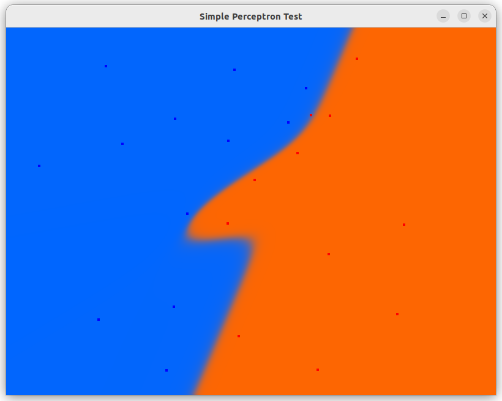

# Simple Perceptron test

## Compilation steps
- Install conan package manager [Conan](https://conan.io)
- Run conan_install.sh
- Run cmake configure: cmake -DCMAKE_BUILD_TYPE=Release -DCMAKE_TOOLCHAIN_FILE=./build/Release/generators/conan_toolchain.cmake -S./ -B./build/Release -G "Unix Makefiles"
- Run cmake build: cmake --build ./build/Release
- Run ./build/Release/SimplePerceptron